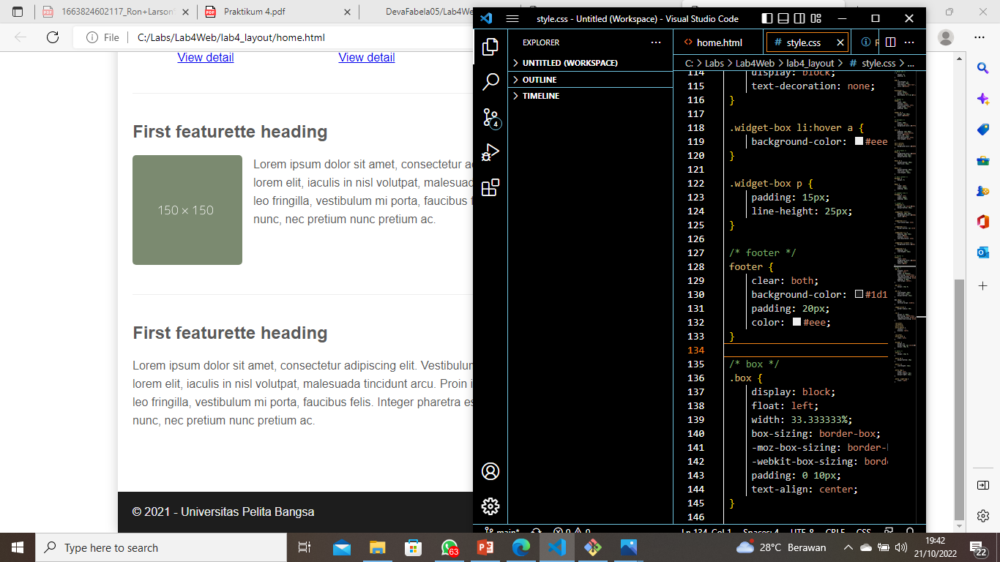

# Lab4Web
## Membuat CSS Layout
### Langkah - langkah Pratikum 4

#### Membuat Box Element
Digunakan untuk membuat BOx Element, Tag yang digunakan dalam merancang layout web adalah tag div dengan konsep box element. Konsep box element terdiri dari Margin, Border, Padding, dan Content. Beginilah tampilannya:

#### Mengatur Clearfix Element
Digunakan untuk mengatur element setelah float element. Property clear digunakan untuk mengaturnya. Inilah tampilannya:

#### Membuat Layout Sederhana
 Inilah tampilannya:

#### Membuat Navigasi
Yaitu dengan menambahkan display dan background pada bagian nav. style.css, berikut tampilannya :

#### Membuat Hero Panel
Dengan menambahkan section id hero pada home.html dan hero panel untuk menata layout pada style css. Berikut tampilannya:

#### Mengatur Layout Main dan Sidebar
Menambahkan main content dan sidebar area pada style.css. Berikut tampilannya:

#### Membuat Sidebar Widget
Menambahkan aside id="sidebar" div class="widget-box" pada home.html. Berikut tampilannya:

#### Mengatur Footer
Mengatur padding, clear both and background pada style.css. Berikut tampilannya :

#### Hasil Pratikum 
Berikut ini adalah tampilan dari praktek yang saya lakukan:

