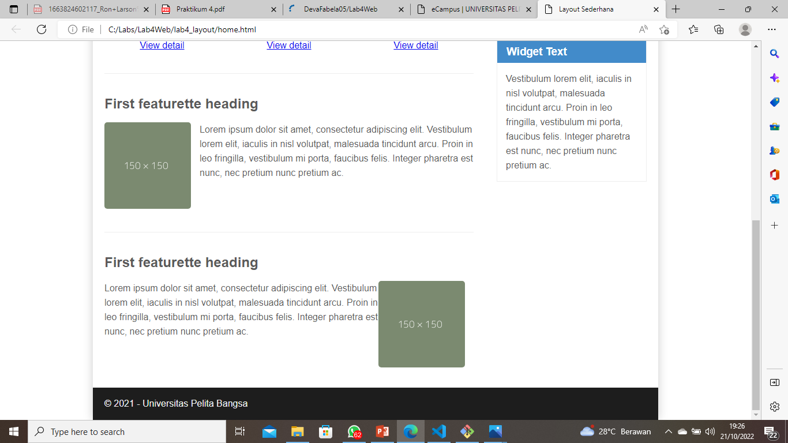

# Lab4Web
## Membuat CSS Layout
### Langkah - langkah Pratikum 4

#### Membuat Box Element
Digunakan untuk membuat daftar dimana tiap bagiannya ditandai dengan sebuah simbol. Ordered list dibuat dengan tag ol. Lalu di dalamnya diisi dengan item-item yang akan dimasukkan ke dalam list. Item dibuat dengan tag li (list item) Beginilah tampilannya:

#### Mengatur Clearfix Element
Digunakan untuk membuat daftar dimana tiap bagiannya memiliki nomor secara terurut. Unordered list dibuat dengan tag ul dan untuk item-nya dibuat juga dengan tag li. Inilah tampilannya:

#### Membuat Layout Sederhana
Digunakan untuk membuat daftar dimana tiap daftar tersebut memiliki penjelasan (sub-bagian). Inilah tampilannya:

#### Membuat Navigasi
HTML Table dapat dibuat dengan tag table, thead, tbody, th, tr, and td. begini tampilannya:

#### Membuat Hero Panel.
Untuk mengatur margin dan padding pada cel data, dengan menambahkan atribut cellpadding dan cellspacing pada tag table. Berikut tampilannya:

#### Mengatur Layout Main dan Sidebar
Untuk menggabungkan sel data, gunakan atribut rowspan dan colspan. Atribut rowspan untuk menggabungkan baris (secara vertikal) dan colspan untuk menggabungkan kolom (secara horizontal), Berikut tampilannya:

#### Membuat Sidebar Widget
Untuk membuat form digunakan tag form dengan atribut action dan method. Atribut action untuk menentukan aksi yang akan digunakan pada saat form dikirim. Dan method adalah untuk menentukan metode yang digunakan dalam mengirimkan data, Berikut tampilannya:

#### Mengatur Footer
Agar tampilan form lebih menarik, bisa ditambahkan CSS. Berikut tampilannya :

#### Hasil Pratikum 
Berikut ini adalah tampilan dari praktek yang saya lakukan:

