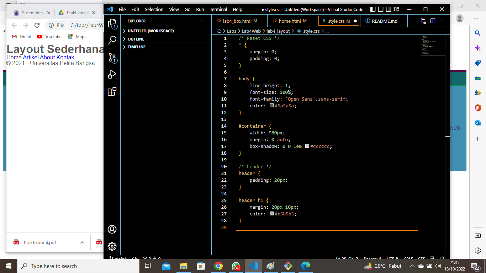

# Lab4Web
## Membuat CSS Layout
### Langkah - langkah Pratikum 4

#### Membuat Box Element
Digunakan untuk membuat  Beginilah tampilannya:

#### Mengatur Clearfix Element
Digunakan untuk  Inilah tampilannya:

#### Membuat Layout Sederhana
Digunakan untuk membuat  Inilah tampilannya:

#### Membuat Navigasi
 begini tampilannya:

#### Membuat Hero Panel.
 Berikut tampilannya:

#### Mengatur Layout Main dan Sidebar
 Berikut tampilannya:

#### Membuat Sidebar Widget
 Berikut tampilannya:

#### Mengatur Footer
 Berikut tampilannya :

#### Hasil Pratikum 
Berikut ini adalah tampilan dari praktek yang saya lakukan:

